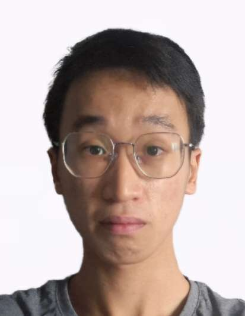

# About Us

We are a team based in the [School of Computing, National University of Singapore](http://www.comp.nus.edu.sg).

You can reach us at the email `seer[at]comp.nus.edu.sg`

## Project team

### Aloysius Goo

[[homepage](https://aloysius.dev)]
[[github](https://github.com/mug1wara26)]

- Role: Developer
- Responsibilites: Features

### Chua Che Khai

[[github](http://github.com/ckhai01)]
[[portfolio](team/chekhai.md)]

- Role: Developer
- Responsibilities: Features

### Wu Yuewei

[[github](http://github.com/sunshinefactoryyy)]
[[portfolio](team/yuewei.md)]

- Role: Developer
- Responsibilities: Features + UI

### Lyris Ng

[[github](http://github.com/sirylcereal)]
[[portfolio](team/lyrisng.md)]

- Role: Developer
- Responsibilities: Features

### Lee Kai Xuan

[[github](https://github.com/TheMythologist)]
[[portfolio](team/leekaixuan.md)]
