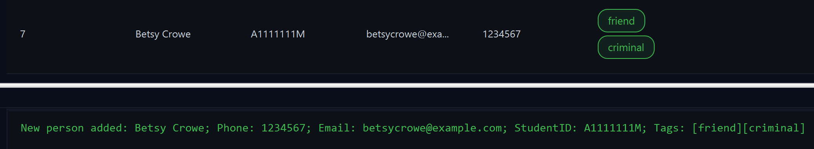
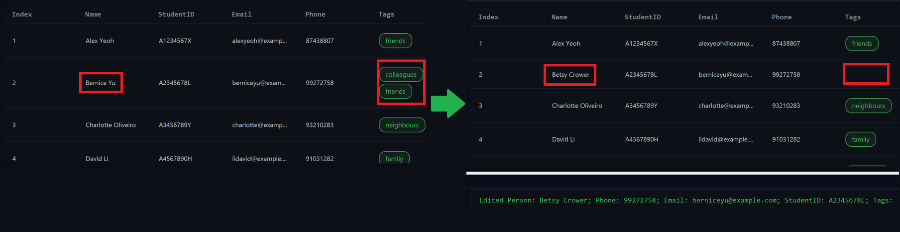
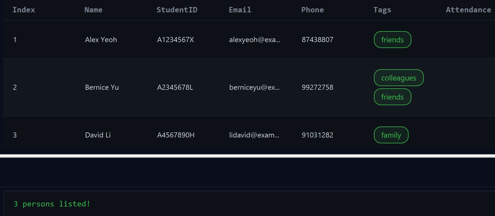

# User Guide

**GreyBook** is a desktop application that helps **NUS clubs and societies efficiently manage contacts and track attendance**. It combines the speed and precision of a Command Line Interface (CLI) with the convenience of a Graphical User Interface (GUI).

Optimized for users who prefer typing commands, GreyBook enables fast, streamlined management — letting you accomplish more in less time than with traditional GUI-based applications.

<box type="tip" seamless>

**New to the CLI?** It simply means typing short commands (like `add` or `list`) instead of clicking through menus and buttons.
</box>

<!-- * Table of Contents -->
<page-nav-print />

---

## About This Guide

### Target Users

This guide is designed for **leaders and committee members of NUS clubs or societies** who:

- Manage members' contact details, emails, and student IDs
- Track attendance for meetings and events
- Prefer efficient, keyboard-driven workflows

### What You'll Need

**Prior Knowledge:**

- Basic computer literacy (e.g., managing files, running applications)
- Familiarity with command-line interfaces is helpful but not required

**Technical Requirements:**

- Java 17 or higher installed on your computer
- At least 50MB of available storage space
- Compatible with any modern operating system (Windows, macOS, Linux)

### How to Use This Guide

- **New users**: Start with [Quick Start](#quick-start) for setup and basic usage
- **Existing users**: Jump to [Command Format Summary](#command-format-summary) for command syntax

---

## Quick Start

### Installation

1. **Check Java Version**

   Ensure you have Java `17` or above installed on your computer.

   ```
   java -version
   ```
   <details>
   <summary>How to Use Terminal?</summary>
   <ul>
   <li><b>Mac Users:</b> Press <code>Cmd + Space</code>, type Terminal in search bar to open.</li>
   <li><b>Windows Users:</b> In the Windows Start menu search bar, type Terminal to open.</li>
   <li><b>Linux Users:</b> Press <code>Ctrl + Alt + T</code> to instantly open a terminal window</li>
   </ul>
   </details>

   <br>

   **Mac users:** Follow [this guide](https://se-education.org/guides/tutorials/javaInstallationMac.html).<br>
   **Windows users:** Follow [this guide](https://se-education.org/guides/tutorials/javaInstallationWindows.html).<br>
   **Linux users:** Follow [this guide](https://se-education.org/guides/tutorials/javaInstallationLinux.html).<br>

2. **Download GreyBook**

   Download the latest `.jar` file from the [Releases Page](https://github.com/AY2526S1-CS2103T-F13-4/tp/releases).<br>
   Copy the file to a folder you want to use as your **home folder** — this is where your GreyBook data will be stored.

3. **Launch the Application**

   Open a terminal, navigate (`cd`) to that folder, and run:

   ```
   java -jar greybook.jar
   ```

   For example:

   ```
   cd Downloads
   java -jar greybook.jar
   ```

   > **macOS users:** If you see a security prompt the first time, right-click the `.jar` → **Open** → confirm.

4. **First Look**

   GreyBook should launch within a few seconds.
   A few sample students are preloaded so you can try out basic commands immediately.

   

---

### Your First Commands

Let's try a few essential commands:

1. **Add a Student**

   ```
   add n/John Doe p/98765432 e/johnd@example.com i/A0000000Y
   ```

2. **Mark Attendance as Present**

   ```
   mark A0000000Y p/
   ```

3. **Unmark Attendance**

   ```
   unmark A0000000Y
   ```

4. **Find a Student**

   ```
   find i/A0000000Y
   ```

Refer to the [Command Format Summary](#command-format-summary) for the full list of supported commands.

---

---

## Command Format Summary

**Notes about the command format:**

- Words in `UPPER_CASE` are called **parameters**, things you replace.<br>
  e.g. in `add n/NAME`, replace `NAME` with a student's name, like `add n/John Doe`.

- Items in square brackets are optional.<br>
  e.g. `n/NAME [t/TAG]` can be used as `n/John Doe t/member` or as `n/John Doe`.

- Items in round brackets are mutually exclusive.<br>
  e.g. `(INDEX | STUDENTID)` can be used as `1` or as `A0000000Y`.

- Items with `…`​ after them can be used multiple times, including zero times.<br>
  e.g. `[t/TAG]…​` can be used as ` ` (0 times), `t/member` (1 time), `t/member t/exco` (2 times) etc.

- Parameters can be in any order.<br>
  e.g. if the command specifies `n/NAME p/PHONE_NUMBER`, `p/PHONE_NUMBER n/NAME` is also acceptable.

- Extra parameters for commands that do not take in parameters (such as `help`, `list`, `exit` and `clear`) will be ignored.<br>
  e.g. if the command specifies `help 123`, it will be interpreted as `help`.

- If a prefix for the command occurs in the argument, you may use quotation marks `"` to escape it.
  e.g. `SomeCommandName p/"p-Slash t/ contains t-Slash" t/tag`

- If you want to use quotation marks `"` in your argument, you have to escape it with a backslash `\`
  e.g. `SomeCommandName t/Quote: \"`

- Likewise if you wanted to use backslashes `\` in your argument, you have to escape it with a backslash.
  e.g. `SomeCommandName t/Backslash: \\`

- If you are using a PDF version of this document, be careful when copying and pasting commands that span multiple lines as space characters surrounding line-breaks may be omitted when copied over to the application. Type them out manually instead!

### Command Summary

| Command  | Description                  | Syntax                                                           |
| -------- | ---------------------------- | ---------------------------------------------------------------- |
| `add`    | Create a new student         | `add n/NAME p/PHONE e/EMAIL i/STUDENTID [t/TAG]…`                |
| `edit`   | Update details               | `edit INDEX [n/NAME] [p/PHONE] [e/EMAIL] [i/STUDENTID] [t/TAG]…` |
| `delete` | Remove a student             | `delete (INDEX \| STUDENTID)`                                    |
| `list`   | Show all students            | `list`                                                           |
| `find`   | Search by name or student ID | `find KEYWORD [MORE_KEYWORDS]…​ [i/ID_FRAGMENT]…​`                 |
| `mark`   | Mark attendance              | `mark (INDEX \| STUDENTID) (p/ \|\| a/ \|\| l/ \|\| e/)`         |
| `unmark` | Unmark attendance            | `unmark (INDEX \| STUDENTID \| 'ALL')`                           |
| `clear`  | Delete **all** students      | `clear`                                                          |
| `help`   | Open the help window         | `help`                                                           |
| `exit`   | Quit the app                 | `exit`                                                           |

---

## Core Features

### Managing Students

GreyBook helps you store, edit, and track students' details with precision.

#### Adding Students : `add`

**Command:**
`add n/NAME p/PHONE e/EMAIL i/STUDENTID [t/TAG]…​`

**Parameters:**

- `n/NAME`: Student's full name (letters, spaces, and certain special characters allowed)
- `p/PHONE`: 8-digit Singapore phone number or International phone numbers (following E.164 Standards)
- `e/EMAIL`: Valid email address
- `i/STUDENTID`: Student's NUS ID (e.g., A0000000Y)
- `t/TAG`: Optional categories (e.g., `t/committee` or `t/freshman`)

<box type="tip" seamless>

**Tip:** A name can only contain letters, spaces, and certain special characters. Refer to the [Parameter Details](#parameter-details) for more details!

</box>

<box type="tip" seamless>

**Tip:** We use a special checksum to validate `STUDENTID` field so only **valid** NUS Student IDs will be accepted!
</box>

**Examples:**

```
add n/John Doe p/98765432 e/johnd@example.com i/A0000000Y
add n/Betsy Crowe p/87654321 e/betsycrowe@example.com i/A1111111M t/operations-team
```

**Expected Output:**



<box type="tip" seamless>

**Tip:** A student can have any number of tags (including 0)
</box>

---

#### Editing Students; `edit`

**Command:**
`edit INDEX [n/NAME] [p/PHONE] [e/EMAIL] [i/STUDENTID] [t/TAG]…​`

**Parameters:**

- `INDEX`: The index number in the displayed student list (must be positive)
- Any combination of optional fields can be updated

**Behavior:**

- Updates replace existing values
- When editing tags, the old tags are replaced entirely
- Use `t/` (empty) to remove all tags

**Examples:**

```
edit 1 p/91234567 e/johndoe@example.com
edit 2 n/Betsy Crower t/
```

**Expected Output:**



---

#### Listing All Students: `list`

**Command:** `list`

<box type="tip" seamless>

**Tip:** Use this command after a `find` command to see all students again!
</box>

---

#### Finding Students: `find`

**Command:** `find KEYWORD [MORE_KEYWORDS]…​ [i/ID_FRAGMENT]…​`

**Parameters:**

- `KEYWORD`: The name of the student
- `i/ID_FRAGMENT`: A substring of a student ID (e.g. `0Y` from `A0000000Y`)j
- You can provide any number of keywords and ID fragments
- The search is case-insensitive. e.g. `hans` will match `Hans`

Students matching at least one keyword or one student ID fragment will be returned.
  e.g. `Hans Bo` will return `Hans Gruber`, `Bo Yang`

Examples:

- `find John` returns `john` and `John Doe`
- `find i/12345` returns anyone with student IDs containing `12345` (e.g. `A0123456J`)
- `find i/12345 i/A0123456J` returns IDs containing `12345` or exactly `A0123456J`
- `find i/12345 alex` returns students named like `Alex Yeoh` or with IDs containing `12345`
- `find alex i/12345` returns same as above (order does not matter)
- `find alex david` returns `Alex Yeoh`, `David Li`<br>
  

---

#### Deleting Students: `delete`

**Command:**
`delete (INDEX | STUDENTID)`

**Parameters:**

- `INDEX`: The index number in the displayed student list (must be positive)
- `STUDENTID`: Student's NUS ID (e.g., A0000000Y)

**Notes:**

- Provide either an index or a student ID — not both

Examples:

- `list` followed by `delete 2` deletes the 2nd student in the GreyBook.
- `find Betsy` followed by `delete 1` deletes the 1st student in the results of the `find` command.
- `delete A0123456J` deletes the student with student ID A0123456J from the GreyBook.

---

#### Clearing all Students: `clear`

**Command:** `clear`

Deletes **all** entries from GreyBook.

<box type="warning" seamless>

**Caution!**
This action cannot be undone!
</box>

---

### Managing Attendance

GreyBook helps you keep track of students' attendance efficiently.

#### Marking Attendance: `mark`

**Command:**
`mark (INDEX | STUDENTID) (p/ | a/ | l/ | e/)`

**Flags:**

| Flag | Status  |
| ---- | ------- |
| `p/` | Present |
| `a/` | Absent  |
| `l/` | Late    |
| `e/` | Excused |

**Notes:**

- Provide **either** an index **or** a student ID — not both
- Only one attendance flag can be used at a time
- Attendance status replaces any previous mark

**Examples:**

```
mark 1 p/
mark A0000000Y e/
```

**Expected Output:**

```
Marked student A0000000Y as Present.
```

---

#### Unmarking Attendance: `unmark`

**Command:**
`unmark (INDEX | STUDENTID | 'ALL')`

**Examples:**

```
unmark 2
unmark A0000000Y
unmark all
```

**Expected Output:**

```
Unmarked attendance for A0000000Y.
```

---

### Application Controls

Greybook also offers some core commands that are essential in every application.

#### Getting Help: `help`

**Command:** `help`

Shows a message explaining how to access the help page.


---

#### Exiting the Application: `exit`

**Command:** `exit`

Closes GreyBook.

---

### Miscellaneous Features

#### Terminal-like Behaviour

Similar to a typical CLI application, use the up or down arrows to navigate your command history. You can also use Ctrl+C to clear the current command!

<box type="tip" seamless>

**Tip:** If you have selected some text in the command, `Ctrl+C` will not clear your command. This way, you can still use `Ctrl+C` to copy the text!
</box>

The command history is saved in the hard disk automatically after every successful command, saved automatically as a JSON file at: `[JAR file location]/history.json`

<box type="warning" seamless>

**Caution!**
It is not recommended to modify this file to alter your command history. If your changes to the history file makes it invalid, GreyBook will discard all history and start fresh on the next run. Before you edit, make a backup copy of the file.
</box>

---

#### Automatic Saving of Data

GreyBook data is saved in the hard disk automatically after any command that changes the data. There is no need to save manually.

The data is saved as a JSON file at: <br>
`[JAR file location]/data/greybook.json`

<box type="warning" seamless>

**Caution!**
Editing this file is recommended for advanced users only. If your changes to the data file makes it invalid, GreyBook will discard all data and start fresh on the next run. Before you edit, make a backup copy of the file.
Some changes can cause the GreyBook to behave in unexpected ways (e.g., if a value entered is outside the acceptable range). Therefore, edit the data file only if you are confident that you can update it correctly.
</box>

---

### Parameter Details

| Parameter   | Description                                              |
| ----------- | -------------------------------------------------------- |
| `NAME`      | Letters, spaces, and certain special characters allowed. |
| `PHONE`     | 8-digit Singapore phone number.                          |
| `EMAIL`     | Must follow valid email format (case-insensitive).       |
| `STUDENTID` | NUS Student ID (e.g., A0123456X).                        |
| `TAG`       | Optional label for categorizing members.                 |
| `INDEX`     | Positive integer (1, 2, 3, …).                           |

<box type="tip" seamless>

**Tip:** Refer to the [FAQ](#faqs) for names with unsupported characters.
</box>

---

## FAQs

**Q: What operating systems does GreyBook support?**<br>
**A:** Any system that can run Java 17+ (Windows, macOS, Linux). If Java runs, GreyBook runs.

**Q: Do I need to install anything besides GreyBook?**<br>
**A:** Yes, **Java 17 or newer**. Check with `java -version`. If it's older, install a current Long Term Support Java version.

**Q: How do I update GreyBook to a new version?**<br>
**A:** Download the new `.jar` and run it. Your existing data in `data/greybook.json` will be picked up automatically if you keep it in the same folder.

**Q: Will I lose my data when I update?**<br>
**A:** No. The data file is separate from the app. Keep `data/greybook.json` with the `.jar` and you're good.

**Q: Where exactly is my data?**<br>
**A:** In `[JAR file location]/data/greybook.json`.

**Q: Can I move GreyBook to another computer (or a USB drive)?**<br>
**A:** Yes. Copy the `.jar` **and** the `data` folder together, as well the config and preferences files, `config.json` and `preferences.json` respectively. If you would to copy the command history as well, copy over the file `history.json`. On the new computer, double-click the `.jar`.

**Q: Is there an undo command?**<br>
**A:** Not currently. Actions like `delete` and `clear` are immediate and irreversible. Consider regular backups of `data/greybook.json`.

**Q: How do I back up my data?**<br>
**A:** Close GreyBook and copy `data/greybook.json` to a safe place (cloud/storage drive).

**Q: I edited the JSON and something broke. What now?**<br>
**A:** Close GreyBook, restore your backup `greybook.json`, then reopen GreyBook. Avoid manual edits unless you're confident.

**Q: Are name searches case-sensitive?**<br>
**A:** No. `hans` matches `Hans`.

**Q: Why doesn't `find Han` match `Hans`?**<br>
**A:** `find` matches **full words**. Use the full word or multiple keywords.

**Q: How do tags work?**<br>
**A:** Add any number: `t/member t/colleague`. Editing tags **replaces** the old set. Use `t/` (empty) to clear all tags.

**Q: Can I store addresses or other fields?**<br>
**A:** Only the fields shown in the command formats are supported (e.g., `n/`, `p/`, `e/`, `i/`, and tags).

**Q: Does GreyBook save automatically?**<br>
**A:** Yes. Changes are saved to `greybook.json` right after each command.

**Q: How many students can I store?**<br>
**A:** There's no hard limit in the app; performance depends on your computer.

**Q: How do I reset GreyBook to factory data?**<br>
**A:** Close the app, delete `data/greybook.json`, and reopen GreyBook (you'll start fresh with sample data).

**Q: What characters are allowed in the name field?**<br>
**A:** Only alphabets and the following special characters are allowed: `(Empty space)`, `,`, `(`, `)`, `/`, `.`, `@`, `-`, `'`.

**Q: My name contains a character that is not allowed in the name. How should I enter my name?**<br>
**A:** Please use standard English (Latin) letters only.
For example, if your name is "محمد", you can enter it as "Mohamed". If your name is "李华", you can enter it as "Li Hua".
Similarly, if your name contains special characters such as accents or diacritics (e.g. "José", "Strauß"), please remove them — e.g. "Jose", "Straus".

**Q: Why are some special characters allowed but not others?**<br>
**A:** This is due to the limitation of the program, as we are unable to support every single possible unicode character. We defer this decision to [Singapore's Myinfo](https://partnersupport.singpass.gov.sg/hc/en-sg/articles/32733563138585-What-are-the-special-characters-allowed-in-Myinfo-Name-data-item) for supported special characters.

---

## Appendix

### Glossary

**Student**: A member of the club or society.
**Tag**: A label used to categorize students (e.g., "committee", "freshman").
**Attendance**: Record of presence, absence, lateness, or excused status at an event.

### Technical Specifications

**System Requirements:**

- **Java Version:** 17 or higher
- **Memory:** 512MB minimum
- **Storage:** 50MB available space
- **Display:** 1024x768 minimum resolution

**Supported Platforms:**

- Windows 10/11
- macOS 10.14 or later
- Linux (Ubuntu 18.04+, CentOS 7+, etc.)

**Data Storage:**

- Stored locally in JSON format
- No internet connection required
- Data is portable and human-readable

---

### Contact Information

**Development Team:**
Project maintained by **CS2103T-F13-4** team
GitHub: [AY2526S1-CS2103T-F13-4/tp](https://github.com/AY2526S1-CS2103T-F13-4/tp)

**Support:**

- Technical issues: Submit a GitHub Issue
- Feature requests: Open a Discussion
- General questions: Refer to FAQ or contact via GitHub Discussions

**Version Information:**

- **Current Version:** 1.4
- **Last Updated:** October 2025
- **License:** MIT License

---

_Thank you for using GreyBook! We hope it helps your club run smoothly and efficiently._
